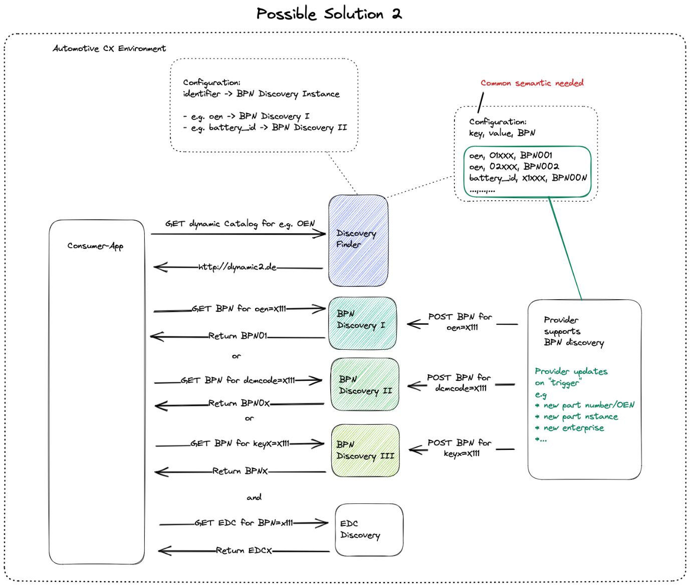

## 2 Architecture and constraints

### Architecture

A consumer sends a request to the Discovery Finder for a catalogue for a
certain type e.g., "bpid". The Discovery Finder responses with a list of
entries. Now the consumer sends a request to the given BPN Finders. If
the BPN Finder finds a matching entry he returns the BPN to the
requester. With the given BPN the consumer can go on and search for the
EDC to this BPN.

### Overall-View

### Constraints

-   Needs to register BPN Discovery to Discovery Finder.

-   Provider must register their entries in BPN Discovery.

-   Every Provider handles its own EDC / Digital Twin - this is no
    central service.

-   User must have a user-role for BPN Discovery.

-   The BPN Discovery is a central component and must be managed by one
    instance.

-   The Discovery Finder and Keycloak services must be up and running.
    Without them the BPN Discovery can't be found or used.

-   Both services, BPN Discovery and Discovery Finder, are depending on
    each other.

### Architecture Constraints

-   Developed under an open-source license and all used frameworks and
    libraries suites to this license.

-   Must be compliant and fulfill the Catena-X Guidelines.

-   The deployment is done in a Catena-X environment. So, the BPN
    Discovery must be able to run in a Kubernetes environment with Helm
    Charts.

-   The BPN Discovery must be managed centralized.

-   Keycloak is needed to manage the identity of and access of the user.