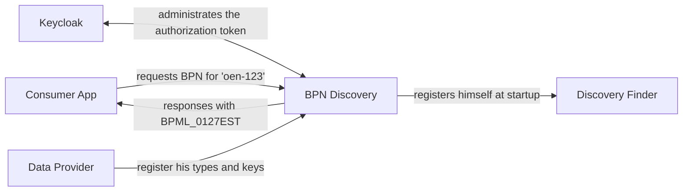
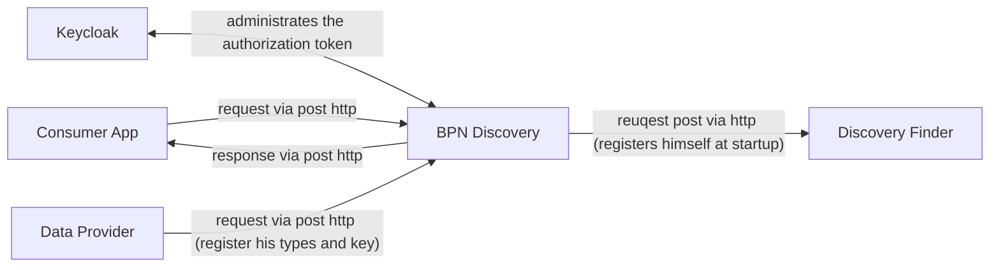

## 3 System scope and context

### Business Context

| Neighbor         | Description                                  |
|------------------|----------------------------------------------|
| Consumer App     | Searches a BPN                               |
| Data Provider    | Registers his type and keys at BPN Discovery |
| Discovery Finder | Provides the endpoints of BPN Discoveries    |
| Keycloak         | Keycloak is used for token validation        |

### Technical Context

| Neighbor         | Description                                                              |
|------------------|--------------------------------------------------------------------------|
| Consumer App     | Requests for BPN with an type and type number                            |
| Data Provider    | Requests for register or delete entries from BPN Discovery               |
| Discovery Finder | Receives request from BPN Discovery of self-registration purpose         |
| Keycloak         | Generates token for users and provides id management of user and service |

### NOTICE

This work is licensed under the [Apache-2.0](https://www.apache.org/licenses/LICENSE-2.0).

- SPDX-License-Identifier: Apache-2.0
- SPDX-FileCopyrightText: 2023 Robert Bosch Manufacturing Solutions GmbH
- SPDX-FileCopyrightText: 2023 Contributors to the Eclipse Foundation
- Source URL: https://github.com/eclipse-tractusx/sldt-bpn-discovery.git