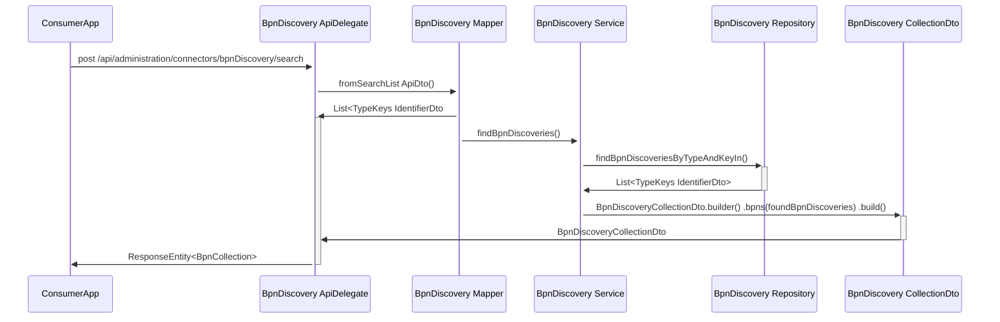
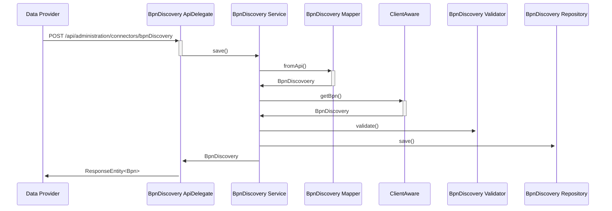
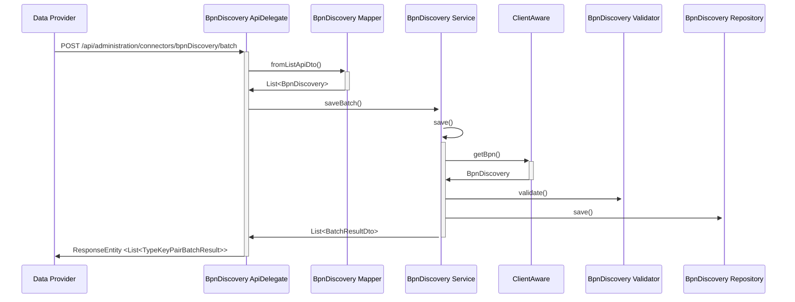
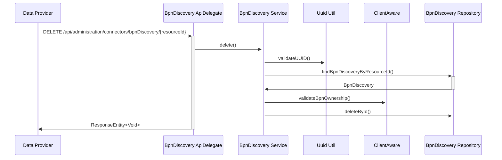

## 4 Runtime-view

### Search request

1.  The ConsumerApp sends a request with a given type number and type to
    BpnDiscoveryApiDelegate.

2.  BpnDiscoveryApiDelegate calls the BpnDiscoveryMapper to map request
    to internal DTO-Class.

3.  BpnDiscoveryApiDelegate calls BPNDiscoveryService to find BPNs.

4.  BPNDiscoveryService calls BPNDiscoveryRepository to search in
    database.

5.  BPNDiscoveryService calls BPNDiscoveryCollection to send the result
    to BpnDiscoveryApiDelegate as a DiscoveryCollectionDto.

6.  BpnDiscoveryApiDelegate send a response to the ConsumerApp with the
    found results.

### Add request

1.  The Data Provider sends a request with one given type number and
    type to BpnDiscoveryApiDelegate.

2.  BpnDiscoveryApiDelegate calls BPNDiscoveryService to save the entry.

3.  BPNDiscoveryService calls the Client Aware to extract the BPN from
    the Token.

4.  BPNDiscoveryService calls the BpnDiscoveryValidator to validate the
    given data.

5.  BPNDiscoveryService calls BPNDiscoveryRepository to save the entry
    in the database.

6.  If succeeded, then BPNDiscoveryService sends a BPNDiscovery-object
    to BpnDiscoveryApiDelegate.

7.  BpnDiscoveryApiDelegate send a response to the DataProvider with the
    new entry in the database.

### Add batch request

1.  The Data Provider sends a request with multiple given type numbers
    for one type to BpnDiscoveryApiDelegate.

2.  BpnDiscoveryApiDelegate calls the mapper to convert it to a
    List<BpnDiscovery>.

3.  BpnDiscoveryApiDelegate calls BPNDiscoveryService to save the entry.

4.  BPNDiscoveryService calls the Client Aware to extract the BPN from
    the Token.

5.  BPNDiscoveryService calls the BpnDiscoveryValidator to validate the
    given data.

6.  BPNDiscoveryService calls BPNDiscoveryRepository to save the entry
    in the database.

7.  If succeeded, then BPNDiscoveryService sends a BPNDiscovery-object
    to BpnDiscoveryApiDelegate.

8.  BpnDiscoveryApiDelegate send a response to the DataProvider with the
    new entry in the database.

### Delete request

1.  The Data Provider sends a request to delete an entry to
    BpnDiscoveryApiDelegate.

2.  BpnDiscoveryApiDelegate calls the BPNDiscoveryService to delete.

3.  BPNDiscoveryService calls UuidUtils to validate the resourceId.

4.  BPNDiscoveryService calls the BPNDiscoveryRepository to find the
    entry.

5.  BPNDiscoveryService calls the ClientAware to validate the ownership
    of the BPN.

6.  BPNDiscoveryService calls BPNDiscoveryRepository to delete the entry
    from the database.

### NOTICE

This work is licensed under the [Apache-2.0](https://www.apache.org/licenses/LICENSE-2.0).

- SPDX-License-Identifier: Apache-2.0
- SPDX-FileCopyrightText: 2023 Robert Bosch Manufacturing Solutions GmbH
- SPDX-FileCopyrightText: 2023 Contributors to the Eclipse Foundation
- Source URL: https://github.com/eclipse-tractusx/sldt-bpn-discovery.git