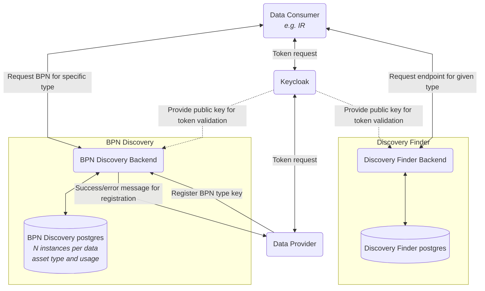

## 6 Crosscutting Concept

### Overall Concept

The overall concept can be found under **2 Architecture and constraints**.

### BPN Discovery API

The BPN Discovery is a central component in the environment. Every
consumer and data provider can call this service via the given api
endpoints.

The Api with its links can be found here: [BPN Discovery Api] (https://semantics.int.demo.catena-x.net/bpndiscovery/swagger-ui/index.html#/Discovery)


#### POST [/api/v1.0/administration/connectors/bpnDiscovery]

Create new numbers (e.g., OEN, batteryID, etc.) corresponding to BPN
endpoints as single entry.

**Request body**

```json
{
  "type": "oen",
  "key": "oen-123"
}
```
**Response**

```json
{
  "type": "oen",
  "key": "oen-1243",
  "value": "bpn-123",
  "resourceId": "1ca6f9b5-8e1d-422a-8541-9bb2cf5fe485"
}
```
This service is allowed to **administrators only**.


#### POST [/api/v1.0/administration/connectors/bpnDiscovery/batch]

Create new numbers (e.g., OEN, batteryID, etc.) corresponding to BPN
endpoints as batch.

**Request body**

```json 
[
  {
    "type": "oenId", 
    "key": "oenId-123"
  }, 
  {
    "type": "oen", 
    "key": "oen-4444"
  }, 
  {
    "type": "bpid", 
    "key": "bpid-123"
  }
]
```

**Response**

```json
[
  {
    "message": "Validation failed.",
    "details": {
      "type": "type oenId is not allowed."
    }, 
    "key": "oenId-123", 
    "status": 400
  }, 
  {
    "message": "BpnDiscovery successfully created", 
    "details": null, 
    "key": "oen-4444", 
    "status": 200
  }, 
  {
    "message": "BpnDiscovery successfully created", 
    "details": null, 
    "key": "bpid-123", 
    "status": 200
  }
]
```

This service is allowed to **administrators only**.


#### POST [/api/v1.0/administration/connectors/bpnDiscovery/search]

Find BPN endpoints corresponding to numbers (e.g., OEN, batteryID, etc.)

**Request body**

```json
{"searchFilter": 
 [
  {
    "type": "oen", 
    "keys": ["oen-1243",
      "oen-11"]
  }, 
  {
    "type": "bpid", 
    "keys": [
      "bpid-1243", 
      "bpid-11"]
  }
 ]
}
```

**Response**

```json
{
 "bpns": 
 [
   {
     "type": "oen", 
     "key": "oen-1243", 
     "value": "bpn-123", 
     "resourceId": "1ca6f9b5-8e1d-422a-8541-9bb2cf5fe485"
   },
   {
     "type": "oen", 
     "key": "oen-11", 
     "value": "bpn-123",
     "resourceId": "972262d7-7e05-4578-936f-de236d7feb94"
   }, 
   {
  "type": "bpid", 
     "key": "bpid-1243", 
     "value": "bpn-444", 
     "resourceId": "1b754aeb-c753-4adf-ae6d-52842f5a38b7"
   }, 
   {
     "type": "bpid", 
     "key": "oen-11", 
     "value": "bpn-444", 
     "resourceId": "e43f9cf8-f0d4-4c51-b7fe-b68ea4aeea7c"
   }
 ]
}
```

#### DELETE [/api/v1.0/administration/connectors/bpnDiscovery/{resourceId}]

Delete numbers (e.g., OEN, batteryID, etc.) corresponding to BPN
endpoints as single entry.

This service is allowed to **administrators only**.

Path variable {resourceId} is required

Response: http Status Code 204 -> no response

An OpenApi.yaml for this service can be found under
"backend/src/main/resources/static/bpn-discovery-service-openapi.yaml" [Link](https://github.com/eclipse-tractusx/sldt-bpn-discovery/blob/main/backend/src/main/resources/static/bpn-discovery-service-openapi.yaml)

### Security / Safety / Use the JWT Token to get the BPN from requester

The whole environment is secured with OAuth2. We used and recommend the Usage of Keycloak. The BPN Discovery has a
realm entry in Keycloak. Every user who wants to use BPN Discovery needs
the corresponding roles for the BPN Discovery.

The roles are:

1. [ ] *VIEW*( "view_bpn_discovery" )
2. [ ] *ADD*( "add_bpn_discovery" )
3. [ ] *DELETE*( "delete_bpn_discovery" )

These roles and the BPN of the requester are send within a JWT Token
generated by Keycloak.

With all three roles it is possible to add and delete entries from the
BPN Discovery Database. To ensure that a user only can delete its own entries the BPN of the database entry and the BPN
from the Token are compared.
This BPN is also used to add new entries to the BPN Discovery.
If only search requests are made the view role is sufficient.

The BPN Discovery registers itself at the Discovery Finder service when
it starts. Therefore, the BPN Discovery has a technical user for the
Discovery Finder.

### Authentication & Authorization
The service is secured by a OAuth2 compliant authorization. Every API call has to provide a
valid Bearer Token. Authorization is provided by a role based access. These roles are possible:

| Role                      | Description                            |
|---------------------------|----------------------------------------|
| view_bpn_discovery   | can search for BPN Discovery endpoints |
| add_bpn_discovery    | can add BPN Discovery endpoints        |
| delete_bpn_discovery | can delete BPN Discovery endpoints     |

The Bearer Token also provide a claim with the BPN. This BPN is used to store entries.
When an entry shall be deleted this BPN is used to verify that the requester is allowed to do so.

### Security Assessment
#### Data Flow Diagram



### NOTICE

This work is licensed under the [Apache-2.0](https://www.apache.org/licenses/LICENSE-2.0).

- SPDX-License-Identifier: Apache-2.0
- SPDX-FileCopyrightText: 2023 Robert Bosch Manufacturing Solutions GmbH
- SPDX-FileCopyrightText: 2023 Contributors to the Eclipse Foundation
- Source URL: https://github.com/eclipse-tractusx/sldt-bpn-discovery.git