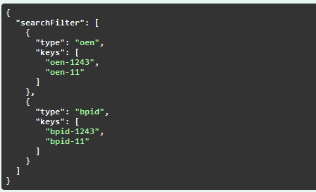
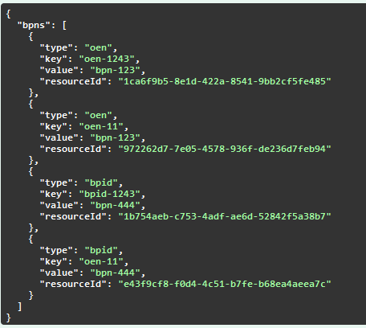
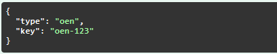
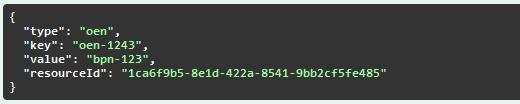
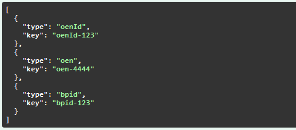
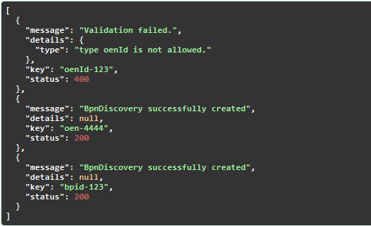
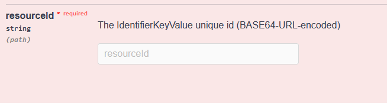
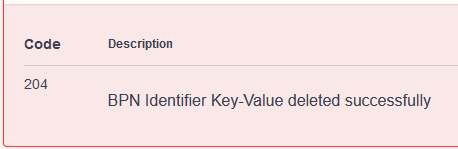

# Developer Documentation Tractus-X BPN Discovery

This page provides an overview of the BPN Discovery.

## Architectural Overview
The Digital Twins are no longer administrated in a central registry. The implementation of two services, "Discovery Finder" and "BPN
Discovery", ensures that EDCs still can be found in the decentralized environment.
The BPN Discovery hereby is responsible to send BPNs for a given type / key combination e.g. for "oen"s.

## Actors
There are two actors who interact with this service.

| Actor         | Description                                                                                   | Example                                                       |
|---------------|-----------------------------------------------------------------------------------------------|---------------------------------------------------------------|
| Data Consumer | The Data Consumer uses the BPN Discovery to search for BPN of a given type / key combination. | A consumer searches for a BPN for type "oen" / key "123-oen". |
| Data Provider | The Data Provider adds or deletes his type / key combinations for his BPN.                    | A provider add a type "oen" / key "123-oen" under his BPN.    |
| Keycloak      | Keycloak is used for token validation                                                         |                                                               |

## BPN Discovery Api
The BPN Discovery provides a Swagger-Interface for all endpoints: https://semantics.int.demo.catena-x.net/bpndiscovery/swagger-ui/index.html

#### Search request

**Request body**

**Response**

#### Add request

**Request body**

**Response**

#### Add batch request

**Request**

**Response**

#### Delete request

**ResourceId**

**Response**

## Authentication & Authorization
The service is secured by a OAuth2 compliant authorization. Every API call has to provide a
valid Bearer Token. Authorization is provided by a role based access. These roles are possible:

| Role                      | Description                            |
|---------------------------|----------------------------------------|
| view_discovery_endpoint   | can search for BPN Discovery endpoints |
| add_discovery_endpoint    | can add BPN Discovery endpoints        |
| delete_discovery_endpoint | can delete BPN Discovery endpoints     |

The Bearer Token also provide a claim with the BPN. This BPN is used to store entries. 
When an entry shall be deleted this BPN is used to verify that the requester is allowed to do so.

## Deployment
To deploy this system, you need to use the Helm Chart in a running
Kubernetes cluster. The Helm Chart is located under "charts/bpndiscovery". For further information checkout the [readme.md](https://github.com/eclipse-tractusx/sldt-bpn-discovery/blob/main/README.md). 

#### Legal Notice
* SPDX-License-Identifier: CC-BY-4.0
* Licence Path: https://creativecommons.org/licenses/by/4.0/legalcode
* Copyright statements
* Source URL: https://github.com/eclipse-tractusx/sldt-bpn-discovery